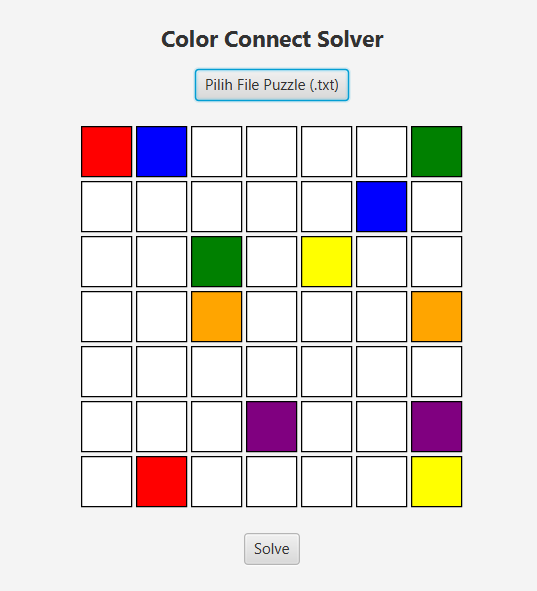
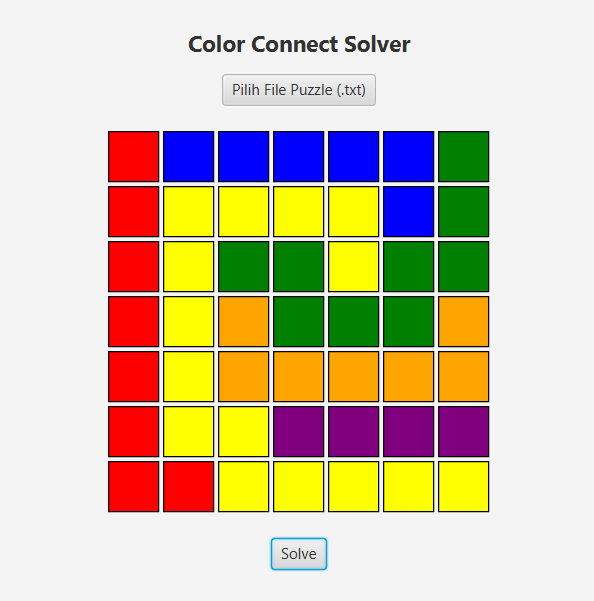

# Color Connect Solver



## a. Penjelasan Singkat Program
Program ini menyelesaikan permainan Color Connect / Flow Puzzle secara otomatis menggunakan algoritma Backtracking yang dioptimalkan dengan heuristik Manhattan Distance. Program memvisualisasikan langkah penyelesaian secara bertahap menggunakan JavaFX dan dapat membaca papan dari file .txt.

### Fitur Utama:
- Menyelesaikan puzzle Color Connect menggunakan backtracking + heuristik manhattan distance.
- Menampilkan visualisasi penyelesaian langkah demi langkah di GUI.
- Mendukung input dari file teks .txt.
- Otomatis menyambungkan semua pasangan titik warna berbeda.

---

## b. Requirement Program dan Instalasi Tertentu

### Requirements:
1. **Java Development Kit (JDK)**: Versi 8 atau lebih tinggi.
   - Unduh dan instal JDK dari [Oracle](https://www.oracle.com/java/technologies/javase-jdk11-downloads.html).
2. **JavaFX**: Dibutuhkan untuk antarmuka grafis.
   - Unduh JavaFX dari [Gluon](https://gluonhq.com/products/javafx/).
3. **Apache Maven**: Dibutuhkan untuk mengkompilasi JavaFX.
   - Unduh Maven dari [Maven](https://maven.apache.org/).
4. **IDE**: Disarankan menggunakan IDE seperti IntelliJ IDEA, Eclipse, atau VS Code dengan plugin Java.

### Instalasi:
1. **Unduh atau Kloning Repositori**:
   - Anda dapat mengunduh repositori ini atau mengkloningnya menggunakan Git:
     ```bash
     git clone https://github.com/username/repository-name.git
     ```
2. **Setup Project**:
   - Jika Anda menggunakan IDE, pastikan untuk mengatur project dengan JDK dan JavaFX yang sudah terinstal.

---

## c. Cara Mengkompilasi Program

Jika Anda ingin mengkompilasi program secara manual, pastikan JDK, JavaFX, dan Maven sudah terpasang dan siap digunakan.

### 1. **Menggunakan Command Line**:
   - Buka terminal di folder proyek Anda.
   - Kompilasi file Java dengan perintah berikut:
     ```bash
     mvn clean compile
     ```

### 2. **Menjalankan Program**:
   - Jalankan program menggunakan perintah berikut:
     ```bash
     mvn javafx:run
     ```

---

## d. Cara Menjalankan dan Menggunakan Program

   - **Input Nama File**: Tekan tombol "Select File" untuk mencari file `.txt` (Contoh format tersedia pada folder /src/main/resources).
   - **Jalankan Algoritma**: Tekan tombol "Solve Puzzle" untuk menjalankan program pencarian solusi puzzle.
   
---

## e. Author / Identitas Pembuat

**Nama**: Theo Kurniady  
**NIM**: 13523154 